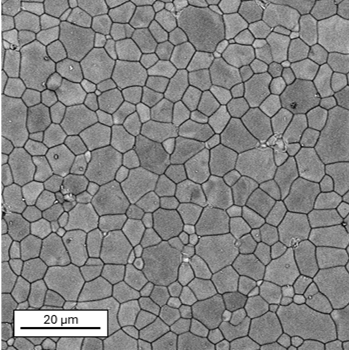
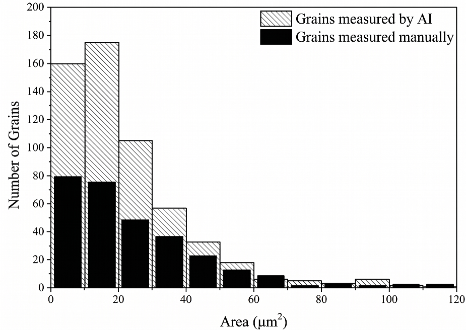
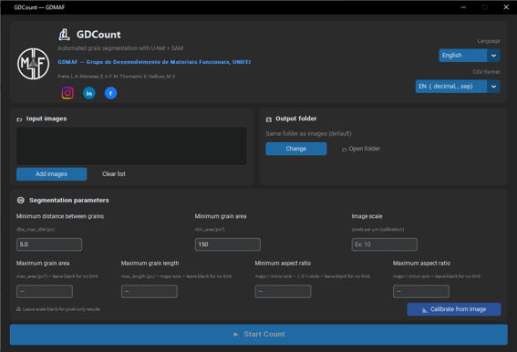
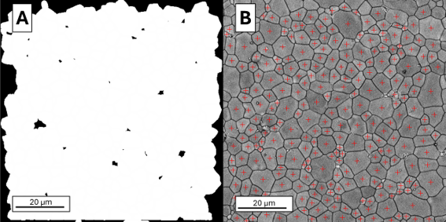

# Summary

GDCount is a deep learning-based segmentation software  for automated grain size characterization of Scanning Electron Microscopy (SEM) images, developed by the Functional Materials Development Group (GDMaF) at the Federal University of Itajubá (UNIFEI), Brazil. The software implements a two-stage deep learning pipeline: a U-Net convolutional neural network performs initial grain segmentation, followed by refinement of individual grain contours using the Segment Anything Model (SAM) developed by Meta AI. GDCount provides a graphical user interface built with CustomTkinter, enabling batch processing of multiple SEM images without requiring programming skills or dedicated GPU hardware. The interface supports English and Portuguese languages, with configurable CSV output formats for international locale compatibility. An interactive calibration tool allows users to measure image scale, minimum grain distance, and minimum grain area directly on the SEM image. For each analyzed image, the software computes grain equivalent diameters and areas, exports statistical summaries, and generates binary segmentation masks and centroid overlay images. The pipeline was validated against manual grain counting on SEM images of polycrystalline calcium manganite (CaMnO3) ceramics, yielding consistent grain area distributions while providing approximately twice the sampling density of the manual approach. The current pre-trained U-Net model was optimized for equiaxial (rounded/spherical) grain morphologies; users requiring segmentation of another particle morphologies are directed to the included retraining guide.

# Statement of need

Grain size characterization is a fundamental step in materials science research, routinely required in studies of sintering kinetics, heat treatment effects, and microstructure–property correlations in ceramic, metallic, and composite systems [@torres2020; @amirkhizi2025a; @amirkhizi2025b]. In practice, this characterization is most commonly performed on SEM images, where individual grains must be identified, segmented, and measured [@torres2020; @amirkhizi2025a]. The conventional approach relies on manual counting and boundary tracing, most notably through the line intercept method, which is time-consuming, inherently subjective, and statistically constrained by the operator's ability to process large image sets [@amirkhizi2025a; @amirkhizi2025b; @sotelo2023; @astme112].

Existing open-source alternatives, most notably ImageJ, provide image processing frameworks widely adopted in the materials science community [@schneider2012]; however, their grain segmentation workflows remain largely manual and do not natively incorporate deep learning-based segmentation, which has shown advantages over classical thresholding for complex microstructures where contrast gradients and irregular grain morphologies reduce the reliability of intensity-based approaches [@sylvester2025]. The segmenteverygrain Python library [@sylvester2025] addresses this limitation by implementing a U-Net + SAM pipeline specifically designed for grain segmentation; however, its use requires a configured Python environment, familiarity with Jupyter notebooks, and direct manipulation of script parameters, a barrier that effectively excludes a large fraction of the experimental materials science community from accessing its capabilities. While segmenteverygrain also provides a Google Colab notebook that partially reduces the local installation barrier, this approach still requires an active internet connection, a Google account, and familiarity with notebook-based execution.

GDCount was developed to bridge this gap. Built upon the segmenteverygrain pipeline, GDCount extends the underlying U-Net + SAM segmentation with a fully self-contained, offline desktop application that requires no programming skills, no Python installation, and no GPU hardware. Beyond the core segmentation pipeline inherited from segmenteverygrain, GDCount contributes: an interactive graphical interface with no command-line interaction; a dedicated calibration tool for scale measurement, minimum grain distance, and minimum grain area directly on the SEM image; an automatic pore-rejection filter based on centroid pixel intensity; configurable geometric post-segmentation filters (maximum area, maximum axis length, aspect ratio range); batch processing of multiple images; a bilingual interface (English and Portuguese); and locale-specific CSV export formats. Distributed as a portable Windows executable, the software is designed for direct deployment in characterization laboratories, enabling researchers and technicians to perform automated, reproducible grain size analysis on batches of SEM images through an accessible point-and-click workflow. By lowering the technical barrier to deep learning-based grain segmentation, GDCount makes statistically robust microstructural characterization accessible to laboratories that would otherwise rely exclusively on manual methods.

# Processing pipeline

GDCount implements a two-stage deep learning pipeline for grain segmentation, built upon the segmenteverygrain library [@sylvester2025]. The pipeline operates as follows. A SEM image (.jpg, .png, or .tif) is loaded and passed to a U-Net convolutional neural network [@ronneberger2015] (pre-trained weights from the segmenteverygrain library [@sylvester2025]), which performs the initial segmentation by identifying grain boundary regions and producing a preliminary instance map. The output is subsequently refined by the Segment Anything Model [@kirillov2023] (ViT-B variant, checkpoint `sam_vit_b_01ec64.pth`), which adjusts individual grain contours with higher boundary precision.

Following segmentation, a post-processing filter automatically rejects spurious detections corresponding to pores or non-grain features. For each detected region, the mean pixel intensity at its centroid is sampled and compared against an automatically computed threshold based on the 25th percentile of the image intensity distribution; this percentile was selected empirically to separate the darker pore regions from the grain-dominated intensity distribution while avoiding misclassification of grain boundary regions. Regions whose centroids fall in dark areas (characteristic of pores) are excluded from the final count. Additionally, users may apply optional geometric filters to further refine results: maximum grain area, maximum major axis length, and minimum and maximum aspect ratio (computed as the ratio of major to minor axis length from measured grains). These filters are applied after segmentation and before output generation, ensuring that the exported CSV, binary mask, and centroid overlay image all reflect only the grains that satisfy the selected criteria.

From the resulting segmentation, grain areas are extracted and equivalent diameters computed as $d = 2\sqrt{A/\pi}$. Results are exported as a delimiter-separated CSV file containing per-grain measurements and summary statistics. An overlay image is also generated, showing red cross markers at the centroid of each counted grain superimposed on the original SEM image, providing a direct visual confirmation of the segmented population.

# Validation

To assess the reliability of GDCount's segmentation pipeline, an independent validation was performed by comparing automated measurements against manual grain counting on a single SEM image of a sintered CaMnO~3~ ceramic, a representative polycrystalline microstructure characterized by equiaxed grains with well-defined boundaries (Figure 1). It is worth noting that some SEM images may require prior digital contrast and sharpness enhancement to ensure adequate segmentation quality; the image used in this validation was of sufficient quality to be processed directly without preprocessing. Manual counting was performed by a trained operator following standard practice in the materials science literature [@amirkhizi2025b; @sotelo2023].

Figure 2 presents the grain area distributions obtained by both approaches. The two histograms exhibit visually comparable distributional profiles with a right-skewed shape, suggesting the absence of systematic bias introduced by the automated pipeline; a formal statistical comparison of the distributions was not performed in this validation. In terms of throughput, manual analysis yielded 301 grains in approximately 15 minutes, while GDCount identified 571 grains from the same image in 6 minutes (running on a 13th Gen Intel Core i7-13620H (2.40 GHz) with 16 GB of RAM (5200 MT/s), CPU-only inference), nearly doubling the sampled population in less than half the time. It should be noted that this higher grain count reflects greater sampling density rather than verified counting accuracy; a ground-truth accuracy assessment relative to an exhaustive annotation was not performed and is outside the scope of this tool paper. This sampling advantage is particularly relevant for studies requiring robust distributional statistics, such as sintering kinetics analyses and microstructure–property correlation studies [@torres2020]. For higher-resolution images, performance gains are expected to be even more pronounced.

# Functionalities and interface

GDCount provides a graphical interface built with CustomTkinter that requires no programming skills or command-line interaction. The interface supports English and Portuguese languages, selectable at runtime via a dropdown in the header, alongside a configurable CSV output format (period decimal/comma separator for EN locale; comma decimal/semicolon separator for BR locale). Users can load multiple SEM images simultaneously through batch input, with results generated independently for each file.

An interactive calibration tool guides users through three sequential measurement steps directly on the SEM image: (1) drawing a line over the scale bar and entering the real length in µm to compute the pixel-to-micrometer conversion factor; (2) clicking on two neighboring grain centroids to measure the minimum inter-centroid distance (*dbs_max_dist*); and (3) drawing a free-form outline around the smallest grain to measure its area (*min_area*). The calibration window supports scroll-to-zoom and right-click-drag panning for precise annotation at any magnification. Measured values are automatically transferred to the main interface and remain manually editable.

Three primary segmentation parameters are configurable through the interface: *dbs_max_dist*, which sets the minimum distance between grain centroids in pixels; *min_area*, which defines the minimum grain area threshold in pixels²; and *px_per_um*, which specifies the pixel-to-micrometer conversion factor for scale-calibrated measurements. Four additional post-segmentation filters are available: maximum grain area, maximum major axis length, minimum aspect ratio, and maximum aspect ratio. These filters allow selective extraction of specific grain populations: for example, setting a maximum aspect ratio isolates equiaxial grains while excluding elongated outliers. All filter fields are optional and default to no constraint when left blank.

Output files are automatically named after each input image and comprise: a delimiter-separated CSV file with per-grain area, equivalent diameter, major and minor axis lengths, orientation, and aspect ratio values alongside mean and standard deviation statistics; a binary segmentation mask (.tif); and a centroid overlay image (.png) showing red cross markers at the location of each counted grain superimposed on the original SEM image. A representative screenshot of the interface is shown in Figure 3 while the mask output is shown in Figure 4.

# Final considerations

Several limitations of the current implementation should be acknowledged. First, the pre-trained U-Net model was optimized for equiaxial (rounded/spherical) grain morphologies; segmentation performance on elongated particles such as needles, plates, or rods is limited and may require model retraining with annotated images of the target morphology. Second, although the automatic centroid intensity filter reduces the incidence of pores being counted as grains, highly porous microstructures or those with complex phase contrast may still require parameter adjustment. Third, as processing is performed exclusively on CPU, analysis of large or high-resolution images may require considerable computation time. Fourth, the validation presented here was conducted on a single SEM image of dense polycrystalline CaMnO3 ceramics; segmentation performance on multiphase or highly porous microstructures has not been systematically evaluated. Fifth, the current distribution is limited to Windows operating systems; users on Linux or macOS would need to run GDCount directly from source in a Python environment.

# Acknowledgements

The authors wish to express their gratitude to the funding agencies that supported this study: CNPq (National Council for Scientific and Technological Development of Brazil – Grant No. 316730/2023-8, and INCT 406322/2022-8), CAPES (Coordination for the Improvement of Higher Level or Education Personnel), and FAPEMIG (Minas Gerais State Foundation of Support to the Research – Grant No. APQ-01856-22) for their invaluable financial support.

# References
